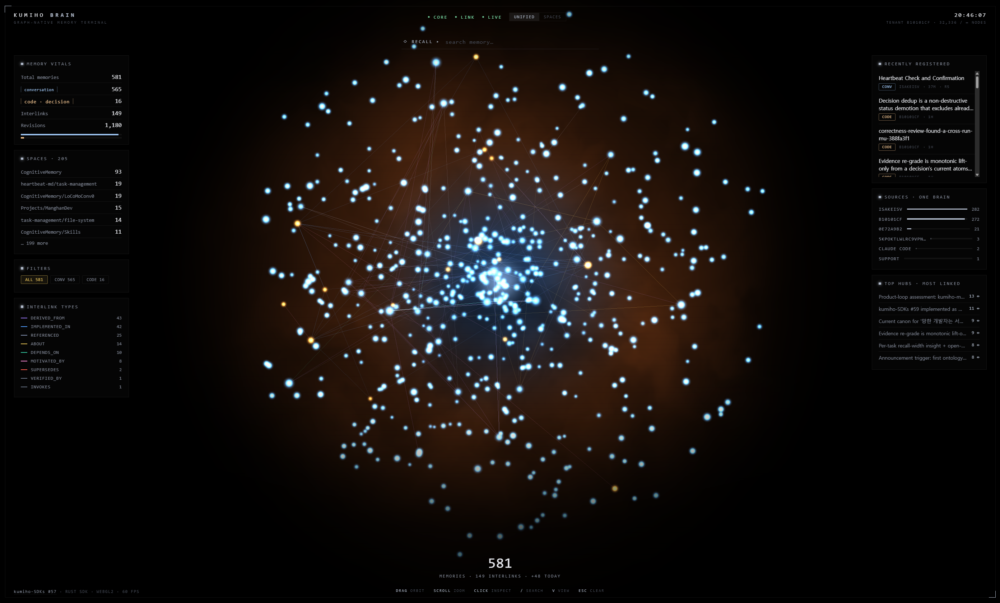

# Kumiho Desktop 🦊🧠

The control center for **Kumiho Memory** — set up the server, connect your
agents, and watch your memory graph grow, live.



Kumiho Desktop is a small native app (Tauri + Rust) that gives the whole Kumiho
stack one front door:

| | |
|---|---|
| **See** | Your living memory graph, GPU-rendered — memories bloom into the orb the moment any client writes them. This is the main view. |
| **Run** | Install, start, stop and health-check the local **Community Edition** server, plus its Neo4j/Redis containers. Tells you when a newer CE is out and updates it in one click. |
| **Connect** | The exact commands to install Kumiho Memory into Claude Code, ChatGPT/Codex, and friends — copy, paste, done. |
| **Account** | Your Kumiho Cloud token, stored in the OS keychain (Keychain / Credential Manager / libsecret) — never a plaintext file. **Save & connect** switches this app to Cloud; **Clear & use CE** brings it back to your local server. |
| **Upgrade** | Community Edition vs Kumiho Cloud, side by side, when you outgrow one machine. |

---

## Install

Grab the installer for your platform from
[**Releases**](https://github.com/KumihoIO/kumiho-desktop/releases):

| Platform | File |
|---|---|
| Windows | `.exe` (NSIS) or `.msi` |
| Linux | `.deb` or `.AppImage` |
| macOS (Apple Silicon) | `.dmg` |

The installer bundles the graph renderer as a sidecar, so the **See** view works
with nothing else to install.

> On Windows the build isn't code-signed yet, so SmartScreen may say
> "unrecognized app" → **More info → Run anyway**. macOS builds are signed and
> notarized.

### Staying up to date

After the first install, Kumiho Desktop **updates itself**. It checks quietly on
launch and shows an **Update** button in the header when a new signed release is
out — one click downloads, installs, and relaunches. No coming back here for
links.

Auto-update covers **macOS** (Apple Silicon), the **Windows** `.exe` installer,
and the Linux **AppImage**. The `.deb`/`.rpm` packages and Intel Macs update by
re-downloading from Releases.

## First run

A setup wizard asks one question — **where should your memory live?**

- **Community Edition** — free, single-user, entirely on your machine. The
  wizard installs the CE server, brings up **Neo4j (and optionally Redis) in
  Docker**, writes `~/.kumiho/server.toml`, and starts everything. If you already
  run Neo4j/Redis, it reuses them instead of creating duplicates.
- **Kumiho Cloud** — managed. Paste a service token (kept in your OS keychain)
  and you're connected.

You can switch anytime from **Settings → Account**: paste a token and
**Save & connect** for Cloud, or **Clear & use CE** to return to your local
server. **Settings → Upgrade** compares the two side by side.

### Requirements

- **Community Edition** — Docker, for Neo4j 5.x (+ optional Redis 7.x). The app
  detects Docker and shows a copy-paste install command if it's missing. Prefer
  to run your own databases? Do — Kumiho reuses whatever is already listening on
  those ports.
- **Kumiho Cloud** — an account at [kumiho.io](https://kumiho.io) and a service
  token.

> Community Edition binds loopback only and is single-user by design: the server
> caps concurrent connections (compiled in). If memory calls stall while the port
> still listens, it is connection-starved — **Settings → Run → Restart** clears it.

## The Brain view

Not a chart of your memory — your memory, rendered.

- **Snapshot + live** — one sweep per memory kind, then a subscription to the
  server's event stream. A new memory blooms into the orb and tops the
  "recently registered" feed within a second or two of the write.
- **WebGL2, no libraries** — particle drift and spring-to-anchor motion
  integrated GPU-side via transform feedback; points drawn as instanced billboard
  quads; typed interlinks colored per edge type; GPU color-picking for exact
  click-to-inspect.
- **Graph-aware layout** — a deterministic spring pass pulls linked memories
  together, so real interlinks read as the short local web they are.

Drag to orbit · scroll to zoom · click to inspect · `/` to search · `V` to switch
between one sphere and a constellation of spaces.

## Build from source

```bash
cargo install tauri-cli --version "^2"
```

On Debian/Ubuntu, install the Tauri system dependencies first:

```bash
sudo apt update && sudo apt install libwebkit2gtk-4.1-dev build-essential curl wget file libxdo-dev libssl-dev libayatana-appindicator3-dev librsvg2-dev
```

Then:

```bash
cargo build --release            # builds kumiho-brain (the graph server)
cargo tauri dev                  # runs Kumiho Desktop
```

In a source checkout the app looks for `kumiho-brain` next to its own executable
first (that's the bundled sidecar in installed builds), then falls back to
`~/.kumiho/bin/kumiho-brain` — so copy the release build there for development:

```bash
cp target/release/kumiho-brain ~/.kumiho/bin/
```

## Repo layout

```
src-tauri/     the Tauri app — Run / Connect / Account / Upgrade commands
desktop-ui/    the control-center frontend (no build step)
src/  static/  kumiho-brain: the axum + WebGL2 memory-graph server (the See view)
scripts/       installers for the standalone brain binary
docs/          notes and assets
```

Releases are cut by pushing a `desktop-v*` tag —
[`desktop-release.yml`](.github/workflows/desktop-release.yml) builds every
platform, signs the bundles, and publishes the installers alongside the
`latest.json` manifest the in-app updater reads.

## Links

- [kumiho.io](https://kumiho.io) — product, pricing, docs
- [KumihoIO/kumiho-plugins](https://github.com/KumihoIO/kumiho-plugins) — agent plugins (Claude Code, Codex, …)
- [KumihoIO/kumiho-server-community](https://github.com/KumihoIO/kumiho-server-community) — the Community Edition server
- [`kumiho`](https://crates.io/crates/kumiho) — the Rust SDK this app talks through
- Paper: *Graph-Native Cognitive Memory for AI Agents* — [arXiv:2603.17244](https://arxiv.org/abs/2603.17244)

MIT licensed. Community Edition itself ships under its own EULA.
